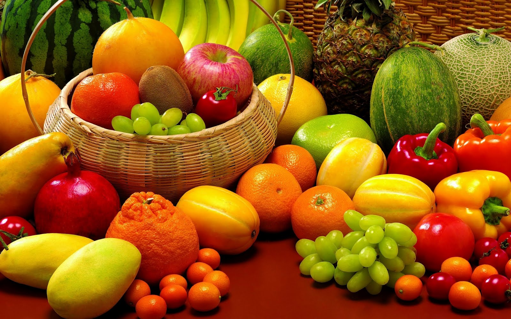

# lista-frutas
Primer ejercicio de HTML y gitHub, en donde debemos hacer un listado de frutas 

###Lista de Frutas
**Frutas Master** es una empresa familiar de  tercera generación que se dedica a la compra, venta y distribución de frutas al por mayor.
En la actualidad, somos la empresa líder en el servicio de distribución de frutas.

**Catálogo:**

1. Manzana
2. Pera
3. Piña
4. Cereza
5. Naranja

